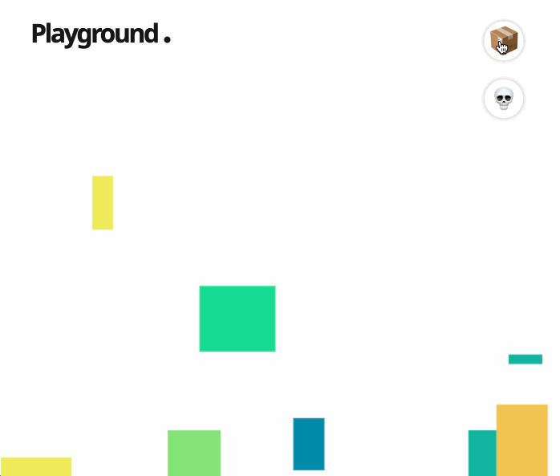

## Hi.
I'm [Alex](https://www.linkedin.com/in/nirenovic/). This is a simple Next.js app I made as a learning exercise. It mainly uses the Matter.js engine to create a physics simulation playground. 

You can create randomly generated boxes, clear them, cause explosions, and turn gravity on and off. 

Have a play around with it via this [GitHub Pages link](https://nirenovic.github.io/playground/).

Here's a preview:  

Have fun!
